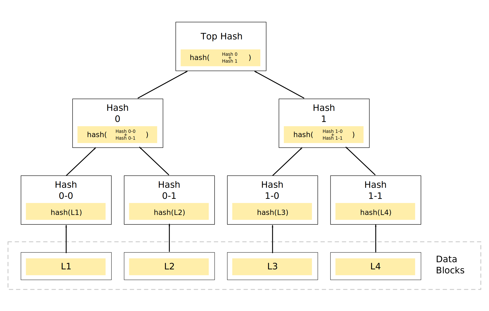

# Blockchain Technology Stack

区块链不是一种技术实现，而是一个系统的架构设计，使用一系列的技术组合用于完成去中心化的数据存储。比特币在区块链之上融入了金融学，货币学，博弈学，甚至一定程度的哲学思想，用于电子货币的发行，运行和交易。

## P2P网络

## 共识算法

 * `PoW` Proof of Work - 工作量证明
 * `PoS` Proof of Stake - 权益证明
 * `DPoS` Delegate Proof of Stake - 委托的权益证明
 * `Ripple Consensus` Ripple共识
 * `PBFT` Practical Byzantine Fault Tolerance - 实用拜占庭容错
 * `Stellar Consensus Protocol` 恒星共识协议

## 不对称加密算法

## [Merkle Tree](https://en.wikipedia.org/wiki/Merkle_tree)

墨克树（Merkle tree）又被称做哈希树（hash tree）。在密码学及计算机科学中，是一种树形数据结构，每个叶节点均以数据块的哈希作为标签，而非叶节点则以其子节点标签的加密哈希作为标签。

哈希树能够高效、安全地验证大型数据结构的内容，是哈希链的推广形式。哈希树的概念由瑞夫·墨克于 1979 年申请专利，故亦称墨克树（Merkle tree）。

## CAP理论

## 最终一致性算法

## UTXO
Unspent Transaction Output

## Reference
 * [如何用架构师思维解读区块链技术？](https://mp.weixin.qq.com/s/jyXsazsCGbStJFVT7el9vg)