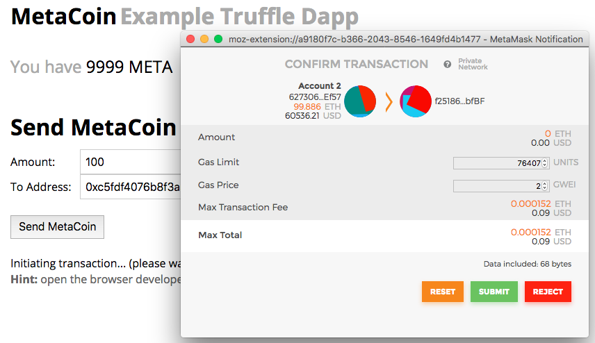
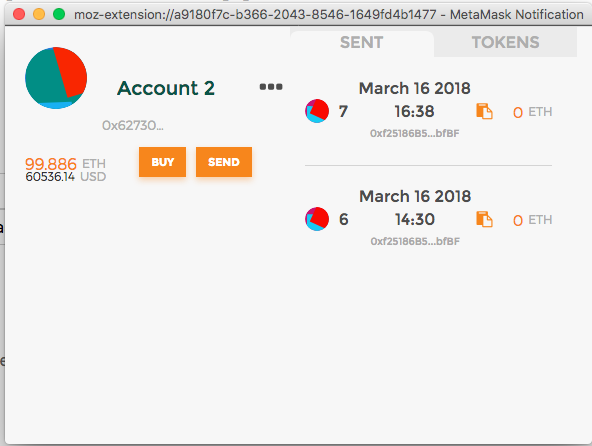

# Truffle Boxes: webpack
[This](http://truffleframework.com/boxes/webpack) box it our most bare official implementation with Webpack. Includes contracts, migrations, tests, user interface and webpack build pipeline.

参考 [Building and testing a frontend app with Truffle](http://truffleframework.com/tutorials/building-testing-frontend-app-truffle-3)

[github](https://github.com/truffle-box/metacoin-box)

## Installation
 * 参考 [Using Truffle Develop and the console](http://truffleframework.com/docs/getting_started/console)

```bash
$ mkdir webpack-truffle-box && cd webpack-truffle-box
$ truffle unbox webpack
```
## Deployment

### 部署到 development blockchain

```bash
$ truffle develop # spawn a development blockchain locally on port 9545
truffle(develop)> compile
truffle(develop)> migrate
truffle(develop)> migrate --reset //重新设置地址
# 查看账号余额
truffle(develop)> MetaCoin.deployed().then(function(instance){return instance.getBalance(web3.eth.coinbase);});
BigNumber { s: 1, e: 4, c: [ 10000 ] }
truffle(develop)> let instance = web3.eth.contract(MetaCoin.abi).at(MetaCoin.address);
truffle(develop)> instance.getBalanceInEth(web3.eth.coinbase);
# 保持 truffle develop 进程运行
$ npm run dev
```

### 部署到自建私链

1. 初始化和启动私链节点

   * [初始化脚本](./ethereum-started/init-devchain.sh)
   * [启动脚本](./ethereum-started/run-devchain.sh)

2. 配置truffle.js: `http://127.0.0.1:8545`

3. 初始化测试账号

```bash
truffle(development)> ("c87509a1c067bbde78beb793e6fa76530b6382a4c0241e5e4a9ec0a0f44dc0d3","password")
```

4. 部署合约

```bash
$ truffle console
truffle(development)> web3.personal.unlockAccount(web3.eth.coinbase, "password", 15000);
true
truffle(development)> compile
truffle(development)> migrate
truffle(development)> networks

Network: development (id: 22)
  ConvertLib: 0x059e17ceb15ef8470b7184b858d356317518aab3
  MetaCoin: 0xd95b1dbec167c6cf547d018ddecf41a4cb2e2f73
  Migrations: 0x8065f4c7b8c2bf53561af92d9da2ea022a0b28ca
$ npm run dev #开发模式
$ npm run build # open build/index.html
```

5. 测试智能合约

```bash
$ truffle console
truffle(development)> web3.personal.unlockAccount(web3.eth.coinbase, "password", 15000);
true
truffle(development)> let account = "0x627306090abaB3A6e1400e9345bC60c78a8BEf57";
undefined
truffle(development)> MetaCoin.deployed().then(function(instance){return instance.getBalance(account);});
BigNumber { s: 1, e: 1, c: [ 99 ] }
```

6. 更多操作

```bash
//转MetaCoin
let account = "0x627306090abaB3A6e1400e9345bC60c78a8BEf57";
MetaCoin.deployed().then(function(instance){return instance.getBalance(account);});
MetaCoin.deployed().then(function(instance){return instance.sendCoin(account,100);});

//转ETH
web3.eth.sendTransaction({from:web3.eth.coinbase, to: account, gas: 100000, value:web3.toWei(10,"ether")});
```

## Running

### Setting up MetaMask
 * 参考 [Truffle and MetaMask](http://truffleframework.com/docs/advanced/truffle-with-metamask)

In the box titled "New RPC URL" enter http://127.0.0.1:<port> and click Save.

 * Ganache: `http://127.0.0.1:7545`
 * Ganache CLI: `http://127.0.0.1:8545`
 * Truffle develop: `http://127.0.0.1:9545`
 * 自建节点: ...

设置端口的代码 `app/javascripts/app.js`: window.web3 = new Web3(new Web3.providers.HttpProvider("..."));

### Send MetaCoin



